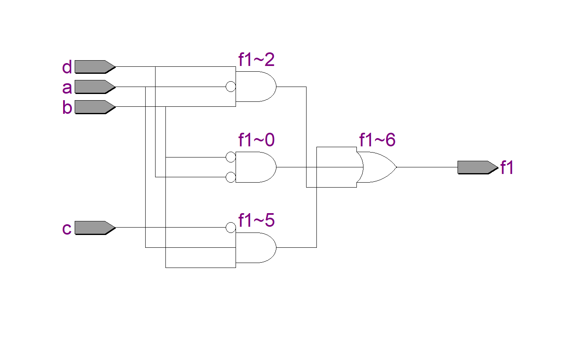
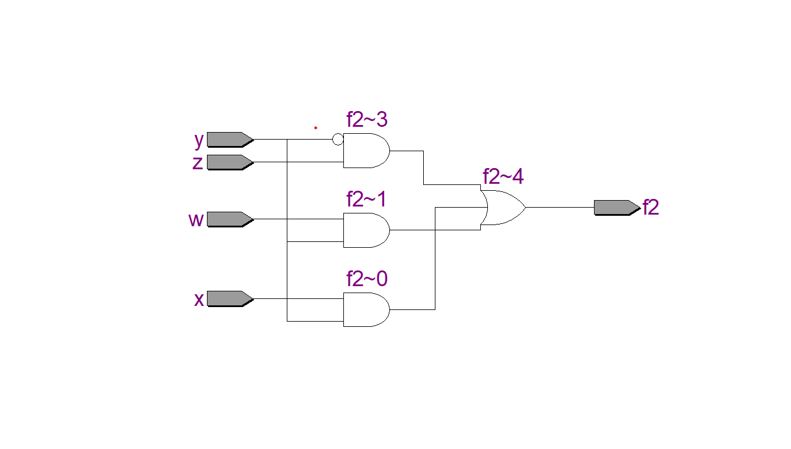
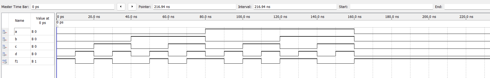
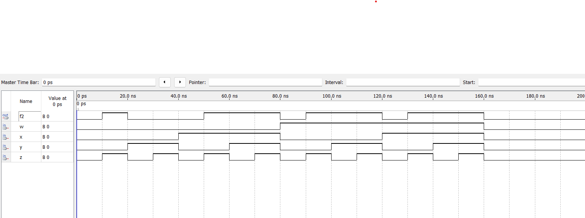

# Experiment--04-Implementation-of-combinational-logic-using-universal-gates
Implementation of combinational logic using universal-gates
 
## AIM:
To implement the given logic function using NAND and NOR gates and to verify its operation in Quartus using Verilog programming.
 F1= A’B’C’D’+AC’D’+B’CD’+A’BCD+BC’D
F2=xy’z+x’y’z+w’xy+wx’y+wxy
 
 
 
## Equipments Required:
 Hardware – PCs, Cyclone II , USB flasher
 Software – Quartus prime


## Theory
 Logic gates are electronic circuits which perform logical functions on one or more inputs to produce one output.

## Procedure
The input and output variables are allocated with letter symbols. The exact truth table that defines the required relationships between inputs and outputs is derived. The simplified Boolean function is obtained from each output. The logic diagram is drawn.

## Program:
```
/*
Program to implement the given logic function using NAND and NOR gates and to verify its operations in quartus using Verilog programming.
Developed by: H.Berjin Shabeck
RegisterNumber:  212222240018
*/
```
```
module combinational(a,b,c,d,f1);
input a,b,c,d;
output f1;
assign f1 = (~b&~d) | (~a&b&d) | (a&b&~c);
endmodule
module combinational(w,x,y,z,f2);
input w,x,y,z;
output f2;
assign f2 = (x&y)|(w&y)|(~y&z);
endmodule
```
## Output:
## RTL



## Timing Diagram





## Result:
Thus the given logic functions are implemented using and their operations are verified using Verilog programming.
